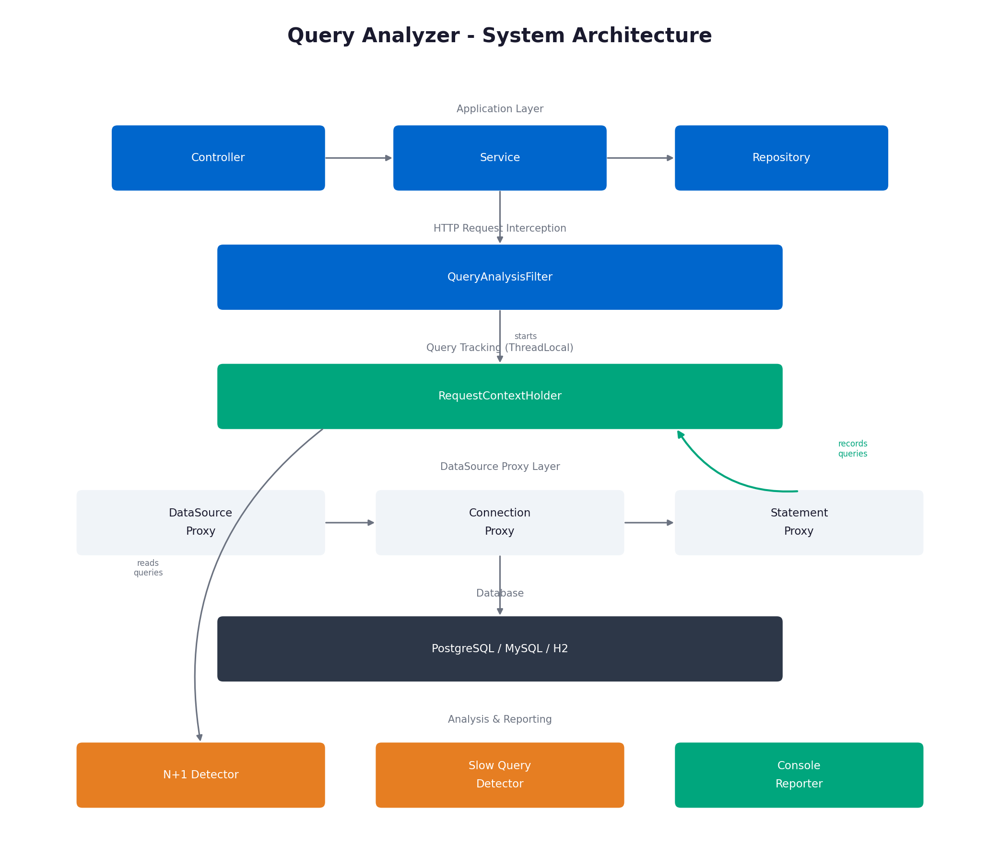
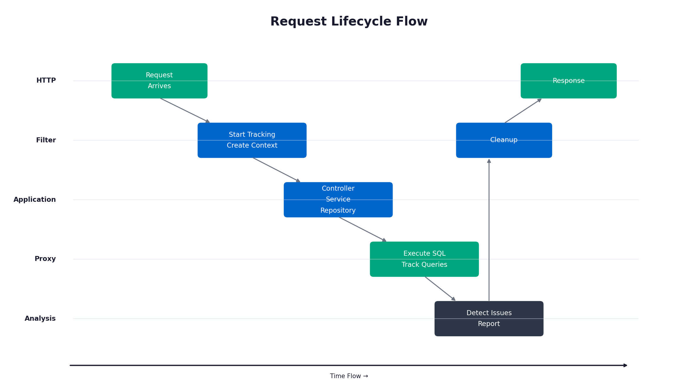

# Query Analyzer

[](https://search.maven.org/artifact/io.github.query-analyzer/query-analyzer-spring-boot-starter)
[](https://github.com/query-analyzer/query-analyzer/actions)
[](https://www.oracle.com/java/)
[](https://spring.io/projects/spring-boot)
[](LICENSE)

A production-grade query performance analyzer for Java applications that automatically detects N+1 queries, analyzes query plans, and provides actionable recommendations. Works with Hibernate, MyBatis, jOOQ, Spring JDBC, or any JDBC-based framework.

## Highlights

- **Test Support** - `@NoNPlusOne` annotation to catch N+1 in unit tests
- **Detection Modes** - THRESHOLD, CONFIDENCE, and HYBRID modes
- **Framework Detection** - Automatic detection of Hibernate, MyBatis, jOOQ, Spring JDBC
- **Framework-Specific Suggestions** - Targeted fix recommendations
- **Relationship Inference** - Infers parent-child relationships from SQL patterns

## Quick Start

### 1. Add Dependency

**Maven:**
```xml
<dependency>
    <groupId>io.github.query-analyzer</groupId>
    <artifactId>query-analyzer-spring-boot-starter</artifactId>
    <version>1.2.0</version>
</dependency>
```

**Gradle:**
```gradle
implementation 'io.github.query-analyzer:query-analyzer-spring-boot-starter:1.2.0'
```

### 2. Run Your Application

That's it! Query Analyzer will automatically:
- Detect N+1 queries
- Analyze query plans (MySQL, PostgreSQL, H2)
- Provide specific recommendations
- Track issues by endpoint

### 3. (Optional) Configure

**Simple:**
```yaml
query-analyzer:
  enabled: true
  profile: BALANCED  # STRICT, BALANCED, or LENIENT
```

**Production:**
```yaml
query-analyzer:
  enabled: true
  profile: LENIENT
  
  detection:
    min-confidence: 0.6

  plan:
    enabled: true
    max-per-request: 3
    timeout-seconds: 2

  reporter:
    minimum-severity: WARNING
```

See [Configuration Guide](docs/CONFIGURATION.md) for complete reference.

## Test Support

Prevent N+1 regressions with the `@NoNPlusOne` annotation:

```java
import io.queryanalyzer.test.NoNPlusOne;
import io.queryanalyzer.test.NoNPlusOneExtension;
import org.junit.jupiter.api.Test;
import org.junit.jupiter.api.extension.ExtendWith;
import org.springframework.beans.factory.annotation.Autowired;
import org.springframework.boot.test.context.SpringBootTest;

@SpringBootTest
@ExtendWith(NoNPlusOneExtension.class)
class UserServiceTest {

    @Autowired
    private UserService userService;

    @Test
    @NoNPlusOne
    void findAllUsers_shouldNotCauseNPlusOne() {
        userService.findAllWithOrders();
        // Test fails if N+1 detected
    }
    
    @Test
    @NoNPlusOne(threshold = 5, ignore = {"audit_log"})
    void customSettings() {
        userService.findAll();
    }
}
```

See [Testing Guide](docs/TESTING.md) for details.

## Features

### Core Detection
- **Automatic N+1 Detection** - Identifies lazy loading issues without code changes
- **Slow Query Monitoring** - Tracks execution times with configurable thresholds
- **Query Plan Analysis** - Analyzes EXPLAIN output to find performance issues
- **Actionable Recommendations** - Suggests specific fixes with code examples

### Detection Modes
- **THRESHOLD** - Simple count-based detection (best for testing)
- **CONFIDENCE** - Multi-signal scoring with stack trace and timing analysis
- **HYBRID** - Both must agree (fewest false positives)

### Framework Support
- **Hibernate/JPA** - JOIN FETCH, @BatchSize, @EntityGraph suggestions
- **MyBatis** - Nested result mapping suggestions
- **jOOQ** - multiset() and JOIN suggestions
- **Spring JDBC** - IN clause batching suggestions

### Production Features
- **Thread-Safe** - Complete request isolation using ThreadLocal
- **Rate-Limited** - Prevents overwhelming database with plan analysis
- **Historical Tracking** - Store and analyze issues over time
- **Request Context** - Associate issues with endpoints and users
- **Minimal Overhead** - <3ms per request without plan analysis

## How It Works

### Overall Architecture

Query Analyzer uses a transparent proxy pattern to intercept JDBC calls without modifying your code:



The system operates through six layers:

| Layer | Components | Purpose |
|-------|------------|---------|
| Application | Controller, Service, Repository | Your code (unchanged) |
| HTTP Interception | QueryAnalysisFilter | Starts/ends tracking per request |
| Query Tracking | RequestContextHolder | ThreadLocal storage for queries |
| Proxy | DataSource, Connection, Statement | Intercepts JDBC calls |
| Analysis | NPlusOneDetector, SlowQueryDetector | Identifies issues |
| Reporting | ConsoleReporter | Outputs results |

### Query Lifecycle

The request lifecycle showing how Query Analyzer intercepts and analyzes queries:



**Flow:**
1. HTTP request arrives at your application
2. `QueryAnalysisFilter` starts tracking via `RequestContextHolder`
3. Your controller/service code executes normally
4. `DataSourceProxy` wraps connections transparently
5. `StatementProxy` intercepts every query and records it
6. Queries execute against the database
7. After request completes, `QueryAnalysisOrchestrator` runs
8. `NPlusOneDetector` analyzes recorded queries for patterns
9. `ConsoleReporter` outputs warnings with fix suggestions

See [Architecture Documentation](docs/ARCHITECTURE.md) for detailed component diagrams.

## Try It Out

### Run Examples

```bash
cd query-analyzer-examples/example-basic
mvn spring-boot:run
```

Then try these endpoints:

**BAD Example (triggers N+1):**
```bash
curl http://localhost:8080/api/examples/bad/n-plus-one
```
Console shows N+1 detection with suggestions.

**GOOD Example (optimized):**
```bash
curl http://localhost:8080/api/examples/good/n-plus-one-fixed
```
Console shows "No Issues Found".

See all examples: [Examples README](query-analyzer-examples/example-basic/EXAMPLES_README.md)

## Extensibility

### Custom Detector

```java
@Component
public class CartesianProductDetector implements QueryDetector {
    
    @Override
    public String getName() {
        return "cartesian-product";
    }
    
    @Override
    public List<QueryIssue> detect(List<QueryInfo> queries) {
        // Your custom detection logic
        return issues;
    }
}
```

Spring Boot automatically discovers and registers your detector.

### Custom Reporter

```java
@Component
public class SlackReporter implements QueryReporter {
    
    @Override
    public void report(List<QueryIssue> issues) {
        issues.forEach(issue -> slack.send(issue));
    }
}
```

## Documentation

### Getting Started
- [Getting Started Guide](docs/GETTING_STARTED.md) - Installation and basic usage
- [Testing Guide](docs/TESTING.md) - Using @NoNPlusOne annotation
- [Examples](query-analyzer-examples/example-basic/EXAMPLES_README.md) - Working examples

### Configuration
- [Configuration Guide](docs/CONFIGURATION.md) - Complete configuration reference
- [Detection Modes](docs/DETECTION_MODES.md) - THRESHOLD vs CONFIDENCE vs HYBRID

### Technical
- [Framework Support](docs/FRAMEWORKS.md) - Hibernate, MyBatis, jOOQ, Spring JDBC
- [Architecture Overview](docs/ARCHITECTURE.md) - System design and components
- [API Reference](docs/API_REFERENCE.md) - Complete API documentation

## Database Support

### Fully Supported (Query Plan Analysis)
- **MySQL / MariaDB** - Full EXPLAIN analysis
- **PostgreSQL** - Full EXPLAIN analysis
- **H2** - Basic EXPLAIN analysis (great for testing)


All databases work for N+1 and slow query detection.

## Requirements

- **Java:** 17 or higher
- **Spring Boot:** 3.x (for starter module)
- **Database:** Any JDBC-compatible database

## Building from Source

```bash
git clone https://github.com/query-analyzer/query-analyzer.git
cd query-analyzer
mvn clean install -DskipTests

# Run examples
cd query-analyzer-examples/example-basic
mvn spring-boot:run
```

## Contributing

Contributions are welcome. Please open an issue to discuss your idea before submitting a pull request.

## License

MIT License - see [LICENSE](LICENSE) for details.

## Author

**Mahmoud Khawaja**

Created to help developers identify and fix database performance issues during development, before they impact production systems.
