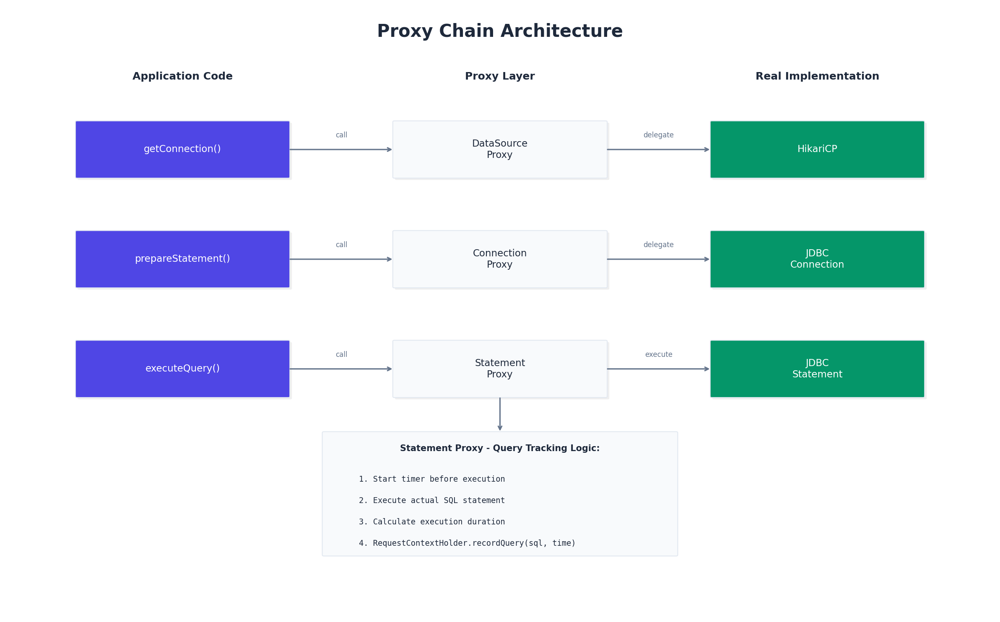
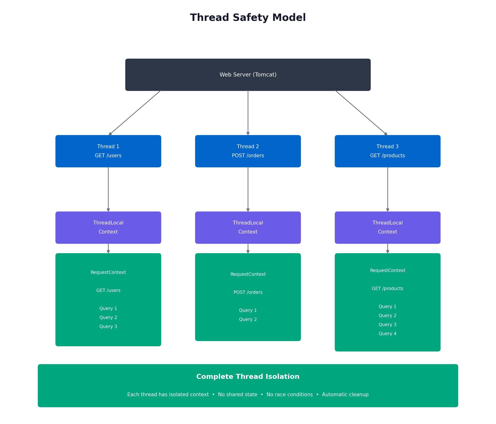

# Architecture

## System Overview

Query Analyzer operates through six layers:

| Layer | Components | Purpose |
|-------|------------|---------|
| Application | Controller, Service, Repository | Your code (unchanged) |
| HTTP Interception | QueryAnalysisFilter | Starts/ends tracking per request |
| Query Tracking | RequestContextHolder | ThreadLocal storage for queries |
| Proxy | DataSource, Connection, Statement | Intercepts JDBC calls |
| Analysis | NPlusOneDetector, SlowQueryDetector | Identifies issues |
| Reporting | ConsoleReporter | Outputs results |

## Module Structure

| Module | Purpose | Dependencies |
|--------|---------|--------------|
| query-analyzer-core | Detection logic | None (no Spring) |
| query-analyzer-spring-boot-starter | Auto-configuration | Core + Spring Boot |
| query-analyzer-examples | Sample apps | Starter |

## Request Flow

## Proxy Chain

## Thread Safety

Each request thread has isolated storage—no shared state, no synchronization needed.

## Performance

| Component | Overhead |
|-----------|----------|
| Query tracking | ~0.5ms/query |
| Analysis | ~3-5ms/request |
| Memory | ~1KB/request |
| **Total** | **<1% typical** |

## See Also

- [How It Works](HOW_IT_WORKS.md) - Detection algorithms
- [Configuration](CONFIGURATION.md) - All options
