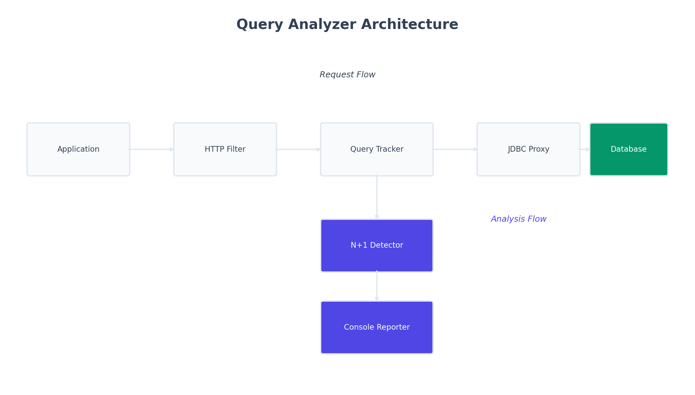

# Getting Started Guide

This guide will help you install and start using Query Analyzer in your Spring Boot application.



Query Analyzer intercepts your database queries, detects performance issues like N+1 queries, and reports them with actionable suggestions.

## Prerequisites

- Java 17 or higher
- Spring Boot 3.2 or higher
- Maven or Gradle
- Any JDBC-compatible database (PostgreSQL, MySQL, H2, etc.)

## Installation

### Maven

Add the dependency to your `pom.xml`:

```xml
<dependency>
    <groupId>io.github.query-analyzer</groupId>
    <artifactId>query-analyzer-spring-boot-starter</artifactId>
    <version>1.2.6</version>
</dependency>
```

### Gradle

Add to your `build.gradle`:

```gradle
dependencies {
    implementation 'io.github.query-analyzer:query-analyzer-spring-boot-starter:1.2.6'
}
```

## Verification

After adding the dependency, run your application:

```bash
mvn spring-boot:run
```

You should see these log messages during startup:

```

  Query Analyzer
  --------------
  Profile: BALANCED
  Status:  ACTIVE

Query Analysis Filter registered for all URL patterns
```

If you see these messages, Query Analyzer is active and ready.

## Basic Usage

Query Analyzer works automatically. Just make HTTP requests to your endpoints:

```bash
curl http://localhost:8080/api/users
```

If any performance issues are detected, you'll see a report in your console.

## Your First Detection

Let's create a simple example that triggers N+1 detection:

### 1. Create Entities

```java
@Entity
public class User {
    @Id
    @GeneratedValue
    private Long id;
    private String name;
    
    @OneToMany(mappedBy = "user", fetch = FetchType.LAZY)
    private List<Order> orders;
    
    // getters and setters
}

@Entity
public class Order {
    @Id
    @GeneratedValue
    private Long id;
    private String productName;
    
    @ManyToOne(fetch = FetchType.LAZY)
    private User user;
    
    // getters and setters
}
```

### 2. Create Repository

```java
public interface UserRepository extends JpaRepository<User, Long> {
}
```

### 3. Create Controller with N+1 Problem

```java
@RestController
@RequestMapping("/api/users")
public class UserController {
    
    private final UserRepository userRepository;
    
    @GetMapping
    public List<UserDTO> getAllUsers() {
        List<User> users = userRepository.findAll();  // 1 query
        
        return users.stream()
            .map(user -> {
                // This triggers N queries (one per user)
                int orderCount = user.getOrders().size();
                return new UserDTO(user.getName(), orderCount);
            })
            .collect(Collectors.toList());
    }
}
```

### 4. Make a Request

```bash
curl http://localhost:8080/api/users
```

### 5. See the Report

Query Analyzer will detect the N+1 pattern and print:

```
--------------------------------------------------------------------------------

  INFO | N+1 Query Detected

  Endpoint        GET /api/users
  Location        UserController.getAllUsers:125

  Problem         10 repeated queries detected for 'orders'
                  Total: 1ms | Avg: 0ms per query
                  Potential improvement: 80%

  Sample Query

      select o1_0.user_id,o1_0.id,o1_0.amount,o1_0.order_date,o1_0.product_name 
      from orders o1_0 where o1_0.user_id=? /* params: 1=1 */

  Suggestions     Confidence: HIGH (100%)
                  ORM/JDBC framework lazy loading detected in stack traces; 
                  Queries executed in tight loop; Queries from same code location

                  Relationship: users -> orders (via user_id) (100% confidence)

--------------------------------------------------------------------------------
```

## Fixing the Issue

Apply one of the suggested solutions:

```java
public interface UserRepository extends JpaRepository<User, Long> {
    
    @Query("SELECT u FROM User u LEFT JOIN FETCH u.orders")
    List<User> findAllWithOrders();
}

@GetMapping
public List<UserDTO> getAllUsers() {
    List<User> users = userRepository.findAllWithOrders();  // Single query
    
    return users.stream()
        .map(user -> new UserDTO(user.getName(), user.getOrders().size()))
        .collect(Collectors.toList());
}
```

Make another request and the console will be silent (no issues to report). You can enable DEBUG logging to see:

```
DEBUG i.q.s.service.QueryAnalysisOrchestrator  : Analyzing 1 queries for GET /api/users
DEBUG i.q.s.service.QueryAnalysisOrchestrator  : No performance issues detected
```

The absence of warning output means your query is optimized!

## Query Plan Analysis

Query Analyzer can analyze database EXPLAIN output to provide deeper insights.

### What You Get

When an ERROR is detected, Query Analyzer automatically:
1. Connects to your database
2. Executes `EXPLAIN` on the problematic query
3. Analyzes the execution plan
4. Adds specific recommendations

### Example Output

```
--------------------------------------------------------------------------------

  ERROR | Slow Query

  Endpoint        GET /api/examples/bad/slow-query
  Location        ExamplesController.slowQuery:124

  Problem         Query took 510ms (threshold: 50ms)
                  Total: 510ms

  Sample Query

      CALL SLEEP(500)

  Query Plan

      ! Full table scan detected
      
      - Run EXPLAIN ANALYZE to understand query execution plan
      - Check if appropriate indexes exist on queried columns

  Suggestions     Run EXPLAIN ANALYZE to understand query execution plan
                  Check if appropriate indexes exist on queried columns

--------------------------------------------------------------------------------
```

### Supported Databases

- **MySQL / MariaDB** - Full support
- **PostgreSQL** - Full support
- **H2** - Basic support (great for testing)
- Oracle, SQL Server - Not yet supported

### Configuration

Plan analysis is enabled by default with safe limits:

```yaml
query-analyzer:
  plan:
    enabled: true           # Enable plan analysis
    max-per-request: 3      # Max 3 plans per request
    timeout-seconds: 2      # 2 second timeout
    min-severity: ERROR     # Only analyze ERROR+ issues
    max-per-minute: 60      # Rate limit
```

### Disable If Needed

For high-traffic production or if using unsupported database:

```yaml
query-analyzer:
  plan:
    enabled: false
```

Detection still works! You just won't get plan analysis.

## Optional Configuration

Query Analyzer works with defaults, but you can customize it:

```yaml
# application.yml
query-analyzer:
  enabled: true
  profile: BALANCED  # NEW: STRICT, BALANCED, or LENIENT
  
  detection:
    n-plus-one: true
    slow-queries: true
    
  plan:
    enabled: true
    max-per-request: 3
    min-severity: ERROR
    
  thresholds:
    warning: 200
    error: 500
    critical: 2000
    
  reporter:
    colors: true
    suggestions: true
    minimum-severity: INFO
```

## Next Steps

- **[Try Examples](../query-analyzer-examples/example-basic/EXAMPLES_README.md)** - 10 working examples
- **[Configuration Guide](CONFIGURATION.md)** - Complete reference
- **[Usage Examples](USAGE_EXAMPLES.md)** - More scenarios
- **[How It Works](HOW_IT_WORKS.md)** - Understand internals
