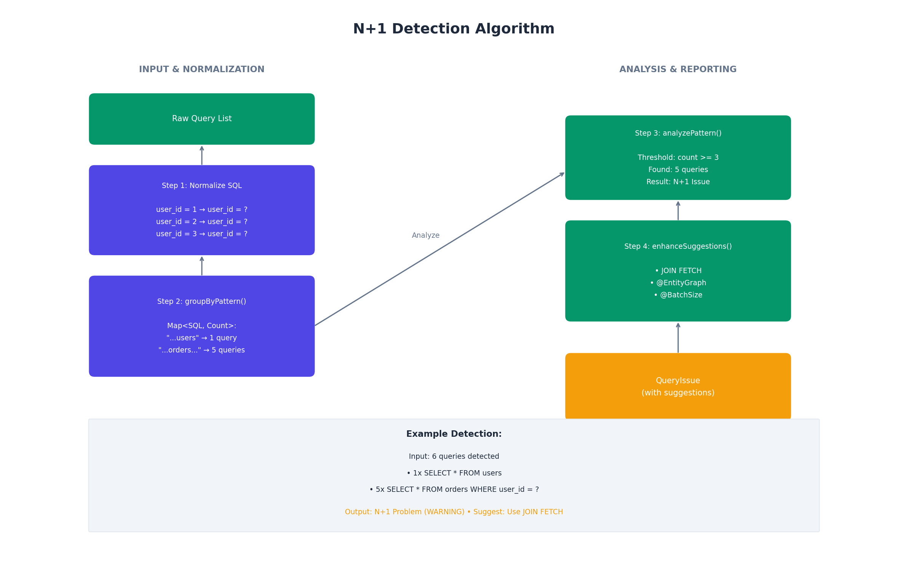

    # How It Works

Query Analyzer intercepts JDBC calls using dynamic proxies, tracks queries per request, and detects performance anti-patterns.

## Request Flow


The filter starts tracking when a request arrives, queries are recorded as they execute, and analysis runs after the response is sent.

## Proxy Chain


Three proxy layers intercept JDBC calls:

| Layer | Intercepts | Purpose |
|-------|------------|---------|
| DataSourceProxy | `getConnection()` | Wraps returned connections |
| ConnectionProxy | `prepareStatement()` | Wraps returned statements |
| StatementProxy | `execute*()` | **Records query + timing** |

StatementProxy is where tracking happens—every query execution is timed and stored.

## Thread Safety


Each HTTP request runs on its own thread with isolated storage using ThreadLocal. No locks needed, no interference between concurrent requests.

## SQL Normalization

Similar queries are grouped by normalizing parameters:

```
SELECT * FROM orders WHERE user_id = 1  becomes  select * from orders where user_id = ?
SELECT * FROM orders WHERE user_id = 2  becomes  select * from orders where user_id = ?
```

This allows N+1 detection by recognizing repeated patterns.

## Detection Algorithm



**Detection Modes:**

| Mode | How It Works | Best For |
|------|--------------|----------|
| THRESHOLD | Count-based (3+ repeated = N+1) | Tests |
| CONFIDENCE | Score-based (stack + timing analysis) | Production |
| HYBRID | Both must agree | Highest accuracy |

## Framework Detection

Query Analyzer detects your ORM from stack traces and provides targeted fix suggestions:

| Framework | Suggestions |
|-----------|-------------|
| Hibernate | JOIN FETCH, @BatchSize, @EntityGraph |
| MyBatis | Nested result mapping |
| jOOQ | multiset(), JOIN |
| Spring JDBC | IN clause batch fetch |

## Query Plan Analysis

For ERROR-level issues, Query Analyzer can run EXPLAIN to detect missing indexes and full table scans.

**Supported databases:** MySQL, PostgreSQL, H2

## Performance Impact

| Operation | Overhead |
|-----------|----------|
| Query tracking | ~0.5ms per query |
| Analysis | ~3-5ms per request |
| **Total** | **<1% typical** |

## See Also

- [Architecture](ARCHITECTURE.md) - Component diagrams
- [Configuration](CONFIGURATION.md) - Tuning options
- [Detection Modes](DETECTION_MODES.md) - THRESHOLD vs CONFIDENCE
